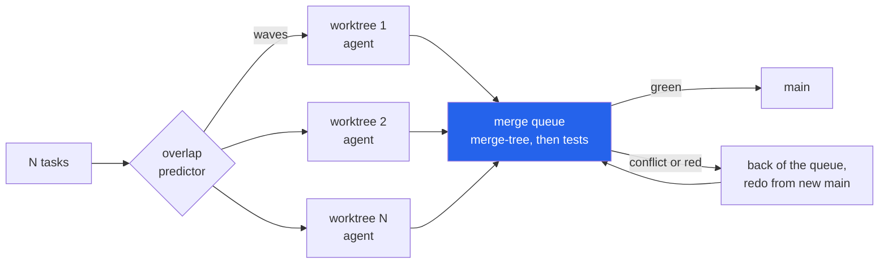

<h1 align="center">worktree-fleet (Python · git worktree · merge queue · Ollama)</h1>
<p align="center"><i>Run N coding agents in parallel git worktrees, integrate them through a tested merge queue, and measure on real history what the parallelism costs</i></p>

<p align="center">
  <a href="#the-through-line">The through-line</a> &middot;
  <a href="#findings">Findings</a> &middot;
  <a href="#input--output">Input / Output</a> &middot;
  <a href="#quick-start">Quick start</a> &middot;
  <a href="#what-this-does-not-do">What it does NOT do</a> &middot;
  <a href="#problems-hit-while-building-this">Problems hit</a>
</p>

<p align="center">
  <a href="https://github.com/hammasbuilds/worktree-fleet/actions/workflows/ci.yml"></a>
  
  
  
  <a href="LICENSE"></a>
</p>

---

Inspired by [stablyai/orca](https://github.com/stablyai/orca), herdr and munder-difflin, which run
fleets of coding agents side by side in git worktrees; no code from any of them is used.

**Status:** replay experiment and every number below: done. Model arm: built and tested against a fake; GPU run pending.

## The through-line



Every task gets its own `git worktree` and its own agent. Finished branches go through one merge
queue: an in-memory three-way merge (`git merge-tree --write-tree`), then the repository's own
test suite on the merged tree, so a merge git calls clean but that breaks a test is still caught.
A task that fails goes to the back of the queue and is redone from main as it then stands. An
optional predictor guesses, *before* any agent starts, which tasks will collide, and splits them
into waves.

To measure what this costs, the fleet replays real history: take N consecutive commits from a
real repository, start all N "agents" from the same base as if they had been launched together,
and let each one produce the change that really happened. Then integrate them and count.

> **Parallel agents mostly collide over files nobody would describe in a task: changelogs, CI
> configuration and lock files. On five real histories, at 16 agents, 42.5% of first attempts had
> to be thrown away, and only a third of those collisions touched a line of Python. A clean merge
> that breaks the tests was rare (1.1%): the test gate caught 81 broken states from 22 changes,
> and 20 of those changes were plain dependencies - a test landing before the code it tests.**

## Findings

Five target histories: [flask](https://github.com/pallets/flask) (two eras, two test
environments), [click](https://github.com/pallets/click), [sqlparse](https://github.com/andialbrecht/sqlparse)
and [more-itertools](https://github.com/more-itertools/more-itertools): 591 windows in all, up to 40 non-overlapping
windows per fleet size per repository, every window run under eight policies, every merge
candidate tested with the repository's own suite. 95% intervals are bootstrap over *windows*
(tasks in one window are not independent), stratified by repository.
All numbers: `results/summary.json`.

| agents N | first attempt thrown away (naive parallel) | ...of which touching `.py` | with changelogs on `merge=union` | clean merge, broken tests | agent work wasted | wall-clock vs serial |
|---:|---|---|---|---|---|---|
| 2 | **9.0%** [6.4, 11.8] | 3.6% | 6.4% | 0.0% | 8.2% | 0.59 |
| 4 | **18.7%** [15.9, 21.5] | 5.9% | 12.3% | 0.3% | 17.2% | 0.44 |
| 8 | **31.4%** [28.5, 34.1] | 10.2% | 21.9% | 0.9% | 30.1% | 0.44 |
| 16 | **42.5%** [39.1, 46.1] | 13.7% | 30.5% | 1.1% | 43.0% | 0.49 |

Wall-clock is makespan in agent rounds (one per wave, plus one per redo) divided by N; serial is
1.00. Past N=8 naive parallelism stops getting faster: every extra agent adds more redos than
it saves rounds.

**Can a predictor avoid it?** Scheduling tasks predicted to collide into separate waves:

| predictor (what it knows before agents start) | N=16: thrown away | wall-clock vs serial | task precision | task recall | pairs held apart |
|---|---|---|---|---|---|
| none (naive parallel) | 42.5% | 0.49 | - | - | 0% |
| task text + repo + prior history (`description`) | 1.0% | **0.97** | 37.2% | 97.4% | 95.5% |
| same, changelogs on `merge=union` | 15.4% | 0.71 | 25.1% | 47.1% | 45.1% |
| exact files of the real change (oracle) | 0.4% | 0.55 | 52.6% | 99.3% | 38.3% |
| exact lines of the real change (oracle) | **0.5%** | **0.43** | 77.3% | 98.7% | 25.8% |

- **The realistic predictor cannot tell.** From the task text it either claims the changelog
  (which nearly every change touches) and so serialises almost everything - wall-clock 0.97,
  no better than running agents one at a time - or, with the changelog taken out of the
  picture, misses half the collisions, because the files that collide (`uv.lock`,
  `.pre-commit-config.yaml`, CI workflows, `requirements/*.txt`) are never named in a task.
- **Knowing the exact lines works** - 0.5% thrown away at 0.43 wall-clock, better than naive
  parallelism on both axes - but no scheduler has those lines before the agents run. It is the
  ceiling, not a method.
- **Oracle recall of ~99% is structural, not skill.** In replayed history every collision is a
  change that edits lines another in-flight task changed, so any footprint containing the real
  files flags it. Of the exact-line oracle's 14 misses, 12 are semantic failures below, which
  share no file with what they depend on. Precision is the informative number: how much
  parallelism each predictor gives up to get there.

**Semantic conflicts.** A replay integrated in history's own order cannot produce one - each
intermediate main is byte-identical to a real, passing commit - so the headline runs integrate
each wave in a seeded shuffle, like agents finishing in any order. Of 6,339 merge candidates the
queue tested that history never contained, 81 broke a test that passed on main and on the task's
real commit. They came from 22 distinct changes:

- **20 were `stale-base`**: the change failed its own tests on its branch alone, because it needed
  another in-flight change - a test-only commit landing before the code it tests, a benchmark
  test landing before the speed-up it checks. No overlap predictor sees these: the two changes
  share no file.
- **2 were one genuine interaction** (more-itertools `d17d077` adds `chunked_even`, `6ccc5d7`
  rewrites its docstring). Replayed onto a base without the function, the docstring edit made
  git's three-way merge rebuild a copy of it; merged with the real addition, git reported a clean
  merge and produced a `SyntaxError` - an unterminated docstring. Each branch passed its tests
  alone.

**Per repository** (N=16, naive parallel):

| repo | windows | thrown away | touching `.py` | changelog only | other files | broken tests |
|---|---:|---|---|---|---|---|
| flask (Werkzeug 3 era) | 7 | 59.8% | 8.0% | 10.7% | 41.1% | 0.0% |
| flask (Werkzeug 2 era) | 3 | 41.7% | 12.5% | 6.2% | 22.9% | 0.0% |
| click | 24 | 54.4% | 10.9% | 22.4% | 21.1% | 0.0% |
| sqlparse | 24 | 45.1% | 18.0% | 16.2% | 10.2% | 0.8% |
| more-itertools | 25 | 23.8% | 14.0% | 0.0% | 7.0% | 2.8% |

more-itertools keeps its changelog in `docs/versions.rst`, which no conventional name matches;
there the `merge=union` rows equal the plain ones and its changelog conflicts count as "other".

## Input / Output

Every sample below is real output.

**1 · Plan four real flask changes** (`fleet plan`). Base `284273e3c5`; the tasks are the next
four first-parent commits.

```console
$ fleet plan --repo targets/flask --base 284273e3c5 \
    --commits 85c5d93cbd,ed1c9e953e,330123258e,adf363679d --predictor oracle-hunks
4 tasks, predictor oracle-hunks: 3 wave(s)
  wave 1: 85c5d93cbd, ed1c9e953e
  wave 2: 330123258e
  wave 3: adf363679d
  85c5d93cbd x adf363679d: docs/index.rst
  ed1c9e953e x 330123258e: CHANGES.rst, docs/templating.rst, src/flask/sansio/app.py, src/flask/sansio/blueprints.py
  ed1c9e953e x adf363679d: CHANGES.rst, src/flask/sansio/app.py
  330123258e x adf363679d: CHANGES.rst, docs/design.rst, docs/patterns/streaming.rst, docs/quickstart.rst, src/flask/helpers.py, src/flask/sansio/app.py, src/flask/templating.py, src/flask/testing.py, tests/test_testing.py

$ fleet plan ... --predictor description
4 tasks, predictor description: 4 wave(s)
  wave 1: 85c5d93cbd
  ...
  85c5d93cbd x ed1c9e953e: CHANGES.rst
  (all six pairs: CHANGES.rst)
```

*The exact-lines oracle keeps two tasks side by side. The description predictor, which only
knows the task text and the repository, serialises all four - over `CHANGES.rst` alone.*

**2 · Run the same four as a naive parallel fleet, test gate on** (`fleet run`).

```console
$ fleet run --repo targets/flask --base 284273e3c5 \
    --commits 85c5d93cbd,ed1c9e953e,330123258e,adf363679d --policy parallel --order listed \
    --python targets/.venvs/flask/Scripts/python.exe --pythonpath src --pytest-args tests
policy parallel: 1 wave(s), makespan 3, 6 agent run(s), 4 test run(s)
  [accepted] 85c5d93cbd (wave 1): accepted
  [accepted] ed1c9e953e (wave 1): accepted
  [accepted] 330123258e (wave 1): agent-failed -> accepted  conflicts: src/flask/sansio/app.py, src/flask/sansio/blueprints.py
  [accepted] adf363679d (wave 1): agent-failed -> accepted  conflicts: CHANGES.rst, src/flask/helpers.py
main is now dfdf45916237 (ref refs/fleet/readme-flask/main)
```

*Two of four agents' first attempts are wasted: their real changes edit lines another in-flight
task rewrote. Both redo cleanly from the new main, and the final tree is byte-identical to
flask's real `adf363679d` - two extra rounds of agent work for the same result.*

**3 · A clean merge that breaks a test** (sqlparse). `e37eaea` adds tests for a feature that
`9a1cb5d` implements; the test commit's agent happens to finish first.

```console
$ fleet run --repo targets/sqlparse --base 8b789f2 --commits e37eaea,9a1cb5d \
    --policy parallel --order listed \
    --python targets/.venvs/sqlparse/Scripts/python.exe --pythonpath . --pytest-args tests
policy parallel: 1 wave(s), makespan 2, 3 agent run(s), 3 test run(s)
  [accepted] e37eaea4a7 (wave 1): semantic -> accepted  broke: tests.test_parse::test_configurable_syntax
  [accepted] 9a1cb5dddd (wave 1): accepted
main is now 729f5a211e72 (ref refs/fleet/readme-sqlparse/main)
```

*Git merges it without complaint; the test gate refuses it. The task goes to the back of the
queue, the feature lands, and the redo passes. No overlap predictor could have seen this: the
two changes share no file.*

**4 · The demo** (`uv run python demo.py`): four hand-written tasks with known answers - two
README edits that must collide, a rename and a new caller of the old name that must merge
cleanly and then break.

```console
predicted collisions (exact-hunk predictor):
  docs-a x docs-b: README.md

 parallel: 1 wave(s), makespan 3, 6 agent runs
   rename  accepted
   shout   semantic -> semantic             merged cleanly, broke test_shout::test_shout
   docs-a  accepted
   docs-b  textual -> agent-failed          conflict in README.md

predicted: 2 wave(s), makespan 4, 6 agent runs
   rename  accepted
   shout   semantic -> semantic             merged cleanly, broke test_shout::test_shout
   docs-a  accepted
   docs-b  agent-failed -> agent-failed     conflict in README.md
```

*Both known answers come out. The predictor separates the README edits, and then the second
one still cannot apply: separating two tasks that edit the same line only moves the conflict.
It also cannot see the rename: an interaction shares no line, so no overlap predictor can.*

**5 · The aggregate** (`fleet report`, the N=16 rows of the pooled table; the whole table is
in `results/report_table.txt`):

```console
scope: all
  N  policy                                   tasks   1st-try fail   textual  semantic   wasted  makespan/N
-----------------------------------------------------------------------------------------------------------
 16  parallel                                  1328          42.5%     41.4%      1.1%    43.0%        0.49
 16  parallel+changelog-union                  1328          30.5%     29.4%      1.1%    31.0%        0.37
 16  parallel:history-order                    1328          42.3%     41.4%      0.9%    30.0%        0.49
 16  predicted:description                     1328           1.0%      1.0%      0.0%     1.2%        0.97
 16  predicted:description+changelog-union     1328          15.4%     15.2%      0.1%    19.2%        0.71
 16  predicted:oracle-files                    1328           0.4%      0.1%      0.4%     0.8%        0.55
 16  predicted:oracle-hunks                    1328           0.5%      0.0%      0.5%     0.7%        0.43
 16  serial                                    1328           0.0%      0.0%      0.0%     0.0%        1.00
```

## How the measurement works

- **Tasks.** Each first-parent commit with a non-empty diff is one task; its commit message is
  the task description (the only thing the realistic predictor sees).
- **Windows.** N consecutive tasks, all started from the parent of the first. Windows do not
  overlap. A window is used only if its base and all N real commits pass their own test suite
  (at most max(5, 2%) failures).
- **Agent.** `ReplayAgent` replays the real change onto whatever base it is given, as
  `git cherry-pick` would. On the commit's real parent that is history; on an older base it fails
  exactly when the change edits lines the base does not have.
- **Attribution.** A test counts against a merge only if it passed on main, is not failing at the
  base or at *any* real commit in the window, and did not flip on a rerun. Every tree with a
  failure is re-run; a run that did not complete is retried from a fresh checkout up to three
  times. A semantic failure is then re-tested on the task's branch alone: failing there too is
  `stale-base`, passing there is an `interaction`.
- **Policies.** `serial`; `parallel` (seeded shuffle, the headline); `parallel:history-order`;
  `parallel+changelog-union` (git's `merge=union` driver on `CHANGES*`, `CHANGELOG*`,
  `HISTORY*`, `NEWS*`); `predicted:{description, description+changelog-union, oracle-files,
  oracle-hunks}`. One redo per failed task.
- **Caching.** Test results are cached by *tree id* and by a hash of the test environment, so
  identical states - common, since most merge results equal a real commit - are tested once.

## Quick start

```bash
git clone https://github.com/hammasbuilds/worktree-fleet
cd worktree-fleet
uv sync

uv run pytest -q              # 70 tests, no network, no model
uv run python demo.py         # the four known-answer tasks above

# your own repository: tasks from a JSON list, agents in worktrees, test gate on
uv run fleet run --repo /path/to/repo --tasks tasks.json --policy predicted \
    --predictor description --python /path/to/venv/python --pytest-args tests

# reproduce the experiment (hours; exact commands below)
bash scripts/fetch_targets.sh && bash scripts/setup_target_venvs.sh
uv run fleet experiment --workers 6 --max-windows 40
uv run fleet report
```

A task file is `[{"id": "...", "description": "...", "commit": "optional sha to replay"}]`.

### Reproduce the experiment

```bash
cd worktree-fleet
bash scripts/fetch_targets.sh            # targets/<name>, pinned heads
bash scripts/setup_target_venvs.sh       # targets/.venvs/<name>, pinned test environments
# run from a frozen copy so edits cannot reach the worker processes mid-run
git worktree add --detach ../wf-snapshot HEAD && cd ../wf-snapshot && uv sync
for t in flask sqlparse click more-itertools flask-2x; do
  uv run fleet experiment --targets ../worktree-fleet/targets.toml --target $t \
    --workers 6 --max-windows 40 --out ../worktree-fleet/results/runs \
    --cache ../worktree-fleet/targets/.fleet
done
cd ../worktree-fleet
uv run fleet report                       # results/summary.json + the table
uv run pytest -q && uv run python demo.py
```

The `fleet plan` / `fleet run` samples are the exact commands shown under Input / Output, run
from the repository root.

The runs in `results/runs/` were produced from a frozen snapshot at commit `f755a7d`. Later
commits changed the report (shared resamples, file-kind breakdown, novel-state count), the CLI
(`--order`, `--python` validation), crash handling for agents, and dropped a per-window pairwise
field the report no longer reads; the fleet, queue, replay and attribution logic the runs used
is unchanged. `fleet report` regenerates `results/summary.json` from those runs.

## The model arm

`OllamaAgent` asks a local model for SEARCH/REPLACE edit blocks, given the task description and
the files the description predictor points at; every generation is cached on disk under
(model, prompt hash, options). It is built and tested against a fake client; its GPU run is
pending. `scripts/run_models.sh --dry-run` prints the job list and the call
count (672 first-attempt calls for flask and click at N=2,4,8 with 8 windows per size, up to
twice that with redos); `scripts/run_models.sh` runs it after checking free RAM, free VRAM and
that the model is pulled.

## Layout

```
src/worktree_fleet/
  gitops.py        git CLI wrapper: merge-tree, commit-tree, worktrees, -U0 diffs
  agents.py        the agent protocol and ReplayAgent
  llm.py           OllamaAgent, the cached Ollama client, SEARCH/REPLACE parsing
  fleet.py         waves, worktrees, parallel agents, re-queue and redo
  mergequeue.py    merge, test, accept or reject
  suite.py         pytest runner: junit parsing, rerun, tree-keyed cache
  predict.py       description / file / hunk predictors
  experiment.py    windows over real history, policies, attribution
  report.py        window-level bootstrap, predictor precision/recall
  targets.py       targets.toml loader
  cli.py           fleet plan | run | experiment | report
scripts/           fetch targets, build their test environments, the model arm
results/           runs/<target>.jsonl, <target>-history.json, summary.json
```

## Requirements

Python 3.11+, git 2.38+ (for `merge-tree --write-tree`), `uv`. No runtime dependencies. The
experiment needs the target repositories and their test environments (the two scripts above);
the test suite and the demo need neither.

## Tests

```bash
uv run pytest -q
```

70 tests, all against throwaway git repositories built in `tmp_path`, running real `git` and a
real nested `pytest`. They cover diff parsing, the in-memory merge and replay, the adjacency rule
git uses for conflicts (the hunk predictor is checked never to miss a conflict git reports on
random edits), flaky and incomplete test runs, the semantic gate, the ignore set, re-queueing,
the in-memory and worktree paths giving identical results, the Ollama agent against a fake
client (and a closed port, never a real server), the bootstrap, and the full experiment end to
end on a small history.

## What this does NOT do

- **It does not measure LLM agents yet.** The replay agent reproduces what humans actually
  wrote. A real agent working from the stale base would write a different patch - the collision
  would then show up at merge time rather than as a patch that cannot apply - and would make
  mistakes of its own. The model arm is built for that; its GPU run is pending.
- **Replay cannot create interaction conflicts from nothing.** Each real change was written
  knowing about the ones before it, so two independent changes that break each other only appear
  if history happened to contain them. One interaction pair in 6,339 novel states is a result
  about these histories, not a rate for fleets of independent agents.
- **A task is a commit, not a PR.** sqlparse's maintainer commits straight to `master`, so one
  feature split over consecutive commits (code, then its tests) becomes two dependent tasks. This
  inflates sqlparse's stale-base count.
- **Five histories, one language.** All Python, all pytest, all small-to-medium libraries.
  flask contributes only the commits whose suite runs in one environment per era: 146 of 396 in
  the Werkzeug 3 era, 71 of 298 in the Werkzeug 2 era (a separate target with its own
  environment).
- **Wall-clock is counted in agent rounds**, not seconds, and a redo is charged a full round.

## Problems hit while building this

- **Windows text-mode stdin corrupted git.** Piping `delete <ref>\n` lines to
  `git update-ref --stdin` failed with `expected SP but got: ?` - Python's text mode had turned
  every `\n` into `\r\n`. All git I/O is now bytes.
- **A relative worktree path pointed at two places.** `git worktree add targets/...` resolves
  against the repository; the test subprocess resolved the same string against the process
  directory, and died with `The directory name is invalid`. Paths are resolved before either sees
  them.
- **Test ids depended on where the worktree lived.** A target with no pytest config of its own
  inherited this project's `pyproject.toml`, so pytest's rootdir became this project and every
  test id embedded the worktree path. The ignore set, built in one worktree, silently matched
  nothing in another, and `--deselect` stopped deselecting. Every run now pins `--rootdir` and,
  when the target has no config, a blank one.
- **pytest 9 broke two years of flask history.** Old flask tests import
  `_pytest.monkeypatch.notset`, gone in pytest 9: 434 failures per commit. The environments pin
  pytest 8.2.2, and the result cache is keyed by a hash of the installed packages so a result from
  one environment is never reused in another.
- **Eight "semantic conflicts" that were not.** The first full flask run reported conflicts whose
  only failure was `<suite-error>` - a run that never produced a report, twice, under machine
  load. Worse, the rerun that should have caught it was skipped: `<suite-error>` had already been
  "confirmed" on a genuinely broken commit, and confirmed failures were not re-run. Incomplete runs
  are now retried from a fresh checkout and can never short-circuit a rerun; after the fix every
  one of the eight vanished.
- **History-order replay can only reproduce history.** With merges clean, each intermediate main
  equals a real commit, which passes by construction - the test gate can never fire. Integration
  order is now a seeded shuffle, and the report counts how many never-seen states were actually
  tested (6,339), so the semantic-conflict rate has a real denominator.
- **Retrying immediately retried too early.** A dependent task that failed was redone at once -
  before the task it depended on had landed - and failed again. Failed tasks now go to the back of
  their wave, as a merge queue re-queues a PR.
- **The pairwise ground truth was empty.** Scoring predictors on pairs "that fail to merge when
  both are replayed onto the base" gave zero positives on every repository: in real history the
  later change of any colliding pair was written on top of the earlier one, so it never applies to
  the base at all. Predictors are scored per task instead.
- **The realistic predictor was a serial scheduler in disguise.** `CHANGES.rst` is touched by
  most flask changes, so a predictor that includes frequently changed files pairs everything. That
  is reported as a result, with the `merge=union` variant beside it.
- **Editing the code under a running experiment crashed it.** Worker processes spawned after an
  edit imported the new code while the parent spoke the old tuple format. Experiments now run
  from a frozen `git worktree` of this repository.
- **flask's Werkzeug 2 era needs Python 3.11.** Its `pkgutil.get_loader` call warns on 3.12 and
  its test config makes every warning an error: 268 of 298 commits failed until the environment
  moved to 3.11.
- **The network kept dropping clones** (`RPC failed; curl 56 Recv failure`). History is fetched
  in `--deepen 60` steps with retries (`scripts/fetch_targets.sh`); flask came from an existing
  local clone.

## Keywords

coding agents &middot; agent fleets &middot; git worktree &middot; merge queue &middot; merge conflicts &middot; semantic conflicts &middot; git merge-tree &middot; parallel development &middot; conflict prediction &middot; changelog merge driver &middot; test gating &middot; bootstrap confidence intervals &middot; Ollama &middot; reproducible evaluation

## License

MIT
